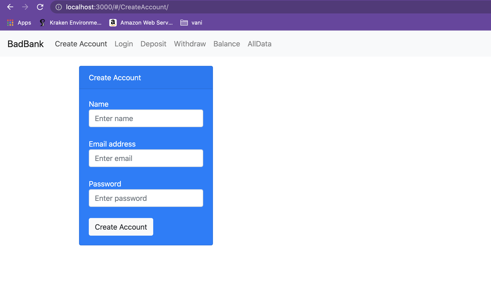

# badbank
Simple bank operations

## Description
- It alllows the user to login and do deposit, withdraw and balance checking

## Installation
- In your command prompt under your project directory run 'git clone https://github.com/vanisbala/badbank'
- run npm install
- run node index.js
- goto your browser and provide 'http://localhost:3000' to run the app

## Technologies used
- [React](https://reactjs.org/)
- [Express](https://expressjs.com/)
- [NodeJS](https://nodejs.org/en/)
- [MongoDB](https://www.mongodb.com/)
- [FireBase](https://firebase.google.com/)

## Screen shots

## Features
- Would like to add authentication 

##  License
- MIT License

